# 2025年十三大最佳AI会议记录工具精选列表(持续更新)

会议结束后忘记关键决策内容、手动整理会议纪要耗费几小时、多时区团队成员无法同步参会信息——这些问题在AI会议记录工具这里都能解决。从Zoom到Google Meet再到Microsoft Teams,这些智能助手能自动加入你的会议、实时转录对话、生成结构化摘要,甚至识别行动项和关键决策点。市面上从完全免费到每月几十美元的方案都有,支持的语言从单一英语到100多种语言覆盖,转录准确率普遍在90-95%以上。这份榜单筛选出13款在转录准确度、会议摘要质量和团队协作功能上表现突出的工具,无论你是需要记录每周例会的团队主管,还是要分析客户电话的销售经理,都能找到适合自己工作流程的方案。

## **[MinutesLink](https://minuteslink.com)**

免费无限会议记录和录音的AI笔记工具,支持50多种语言,自动生成数字化身助手。

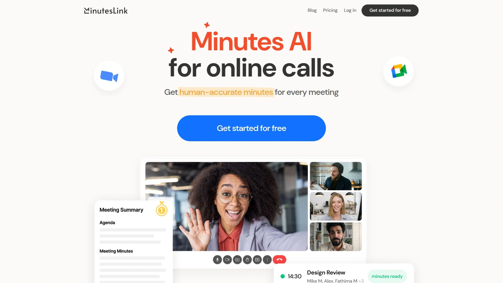

MinutesLink通过Google账号一键登录后,AI助手会自动加入你日程表上的Google Meet和Zoom会议,无需任何额外设置。整个过程完全自动化——录音、实时转录、生成完整会议纪要、提取任务清单,全部在后台完成。会议结束后你会收到包含摘要和待办事项的完整记录。

**免费套餐非常慷慨**,提供无限次会议记录和录音功能,支持50多种语言,每月包含10次AI会议摘要和文字转录。如果需要更多功能和使用频次,可以选择Pro或Business套餐。这种定价策略让小团队和个人用户能够零成本开始使用,先体验价值再决定是否升级。

独特之处在于MinutesLink会随着时间积累数据来训练**个性化AI数字化身**。这个数字化身能够处理任务、参与对话,甚至为专业人士提供通过订阅访问化身知识库来变现专业技能的新方式。对于咨询顾问、培训师或领域专家来说,这是一个将会议积累转化为可持续收入的创新路径。

转录准确度基准测试显示MinutesLink在多种AI模型中表现稳定。平台遵循GDPR和CCPA等全球数据保护法规,采用端到端加密保护对话隐私。用户可以随时删除或修改自己的数据。目前支持Google Meet、Zoom和Google Calendar,Microsoft Teams支持即将推出。适合需要多语言支持、重视数据隐私、希望探索AI数字化身应用的团队和个人专业人士。

## **[Fireflies.ai](https://fireflies.ai)**

行业领先的AI会议助手,95%转录准确率,支持100多种语言,50万家企业信赖。

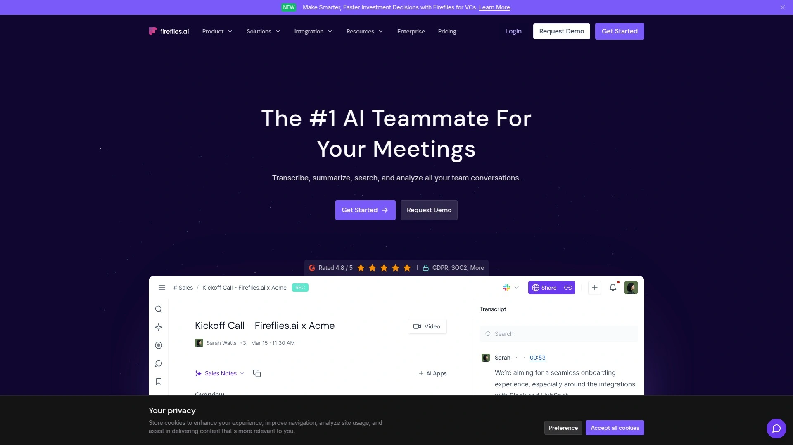

Fireflies以**95%的转录准确率**在行业内处于领先地位。支持超过100种语言的转录,包括英语、西班牙语、法语等主流语言。自动语言检测功能让多语言团队无需手动切换,系统会根据会议语言自动调整。

AI助手Fred可以加入Zoom、Google Meet、Microsoft Teams和Webex等主流视频会议平台。除了机器人模式,还提供Chrome扩展、移动App和API接入等多种捕获方式。甚至可以上传音频和视频文件进行离线转录,适合处理历史会议录音。

AI摘要功能自动整理会议要点,AskFred智能搜索让你能用自然语言提问,快速找到历史会议中的关键信息。对话智能分析自动追踪每个参与者的发言时间,轻松监控会议参与度。集成超过200个AI应用,可以自动提取关键细节、生成跟进邮件、评分候选人等。

免费套餐提供基础功能,付费套餐根据团队规模和需求定制。通过GDPR和SOC2认证,确保数据安全。CRM集成让销售团队能自动同步会议记录到Salesforce、HubSpot等系统。Reddit用户实测33场会议后认为Fireflies在转录准确度和自动化程度上表现出色,但偶尔需要手动修正说话人标识。适合大型企业、多语言团队、需要深度分析和CRM集成的销售和客户成功部门。

## **[MeetGeek](https://meetgeek.ai)**

提供业内最佳AI会议摘要的智能助手,支持50种语言,测试显示转录准确率超95%。

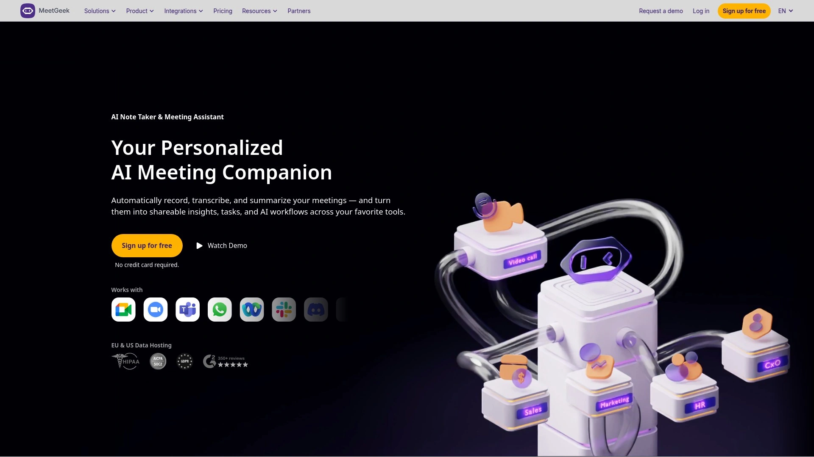

MeetGeek被多位深度用户评为**2025年最佳AI会议记录工具**。核心优势在于它生成的会议摘要质量——系统会将会议内容精准拆分为任务、下一步行动、关注点、事实陈述和决策几个维度。这种结构化呈现让你无需阅读完整转录就能快速把握会议核心。

自动转录和录制功能支持Microsoft Teams、Zoom和Google Meet。转录时使用说话人ID和时间戳标记,方便追踪谁在什么时候说了什么。音频质量会影响转录准确度,但使用普通PC内置麦克风测试显示准确率仍能达到95%以上。

**团队协作工具**特别实用。可以创建和分享会议片段、在会议记录上添加评论、一键发送记录给团队成员。可搜索的会议库让你轻松查找和回顾历史通话。支持编辑会议记录,从虚拟会议中添加或删除特定要点。

视频录制功能在招聘流程中特别有用,可以和转录及会议记录一起分享给团队成员。Chrome扩展和移动App让录制更灵活,既能处理线上会议也能录制面对面对话。与Notion、Slack、ClickUp、Pipedrive、HubSpot等主流工具集成。

定价从免费套餐开始,提供基础转录和摘要功能。适合需要高质量会议摘要、重视团队协作、希望建立可搜索知识库的各类企业团队。

## **[Tactiq](https://tactiq.io)**

轻量级Chrome扩展,专为Google Meet、Zoom和MS Teams设计,70万用户信赖的免费AI笔记工具。

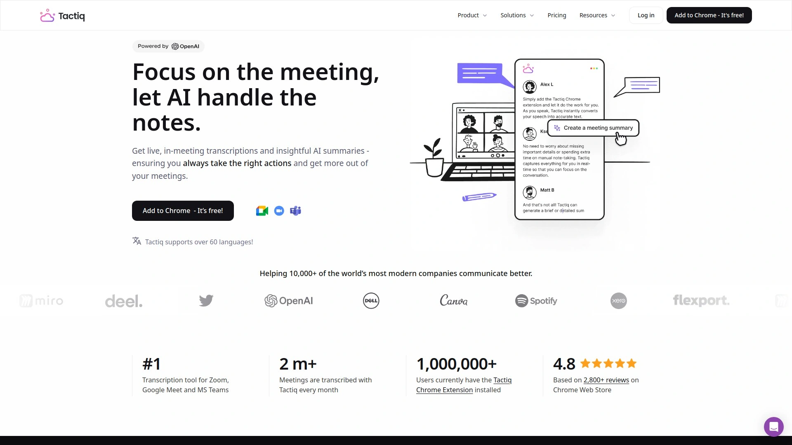

Tactiq以Chrome扩展形式运行,安装后无需额外设置即可开始使用。一键启动,自动转录会议、高亮关键见解、标记重要任务、保存聊天对话、截取屏幕截图,然后整合成一份精美的可分享AI会议摘要。

集成**GPT-4技术**提供超高准确度的AI会议摘要,保留每一个细节。生成式AI自动检测行动项、关键要点等重要信息。支持Google Meet、Zoom和Microsoft Teams三大主流平台。

70万用户分布在2万多家公司,包括财富500强领导者、工程师、自由职业者、销售和营销人员。实时转录功能确保不遗漏任何词句。搜索功能让你能跨所有转录记录查找口语文本,让会议笔记更有组织性和可访问性。

可以直接保存转录到Google Docs、Notion、Dropbox或导出为PDF。AI会议助手能在几秒钟内回答问题、提取关键要点、生成报告。甚至支持YouTube视频摘要——上传转录即可获得无缝的AI生成笔记。

**完全免费使用**,没有隐藏费用。轻量级设计不占用系统资源,不会让会议变慢。Edge浏览器也支持扩展安装。Google Workspace Marketplace和各大应用商店均可下载。适合个人用户、小型团队、预算有限但需要可靠转录和AI摘要功能的所有人。

## **[Otter.ai](https://otter.ai)**

AI笔记工具的行业标准,提供会议转录、见解分析和自动化工作流,企业级团队首选。

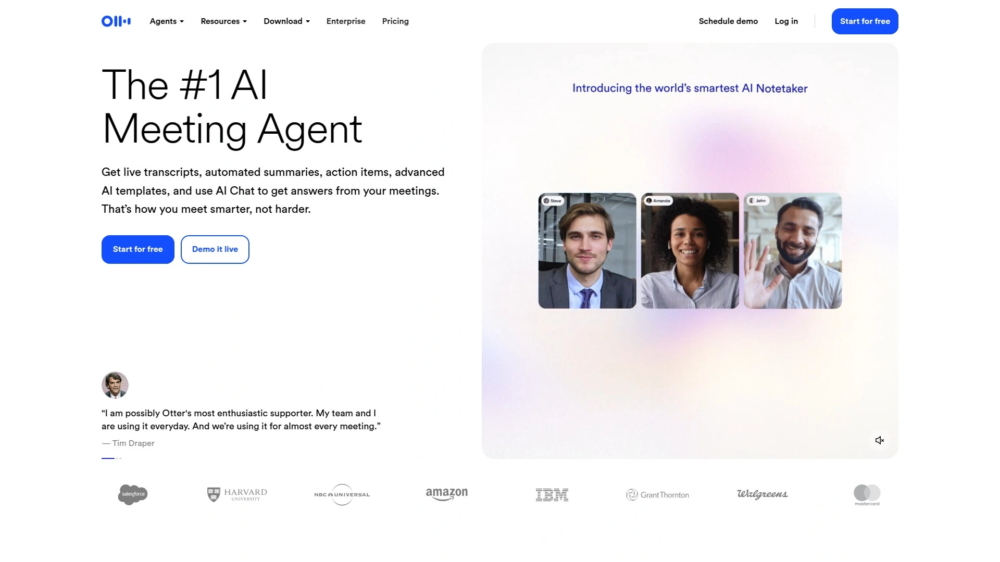

Otter是AI会议记录领域的知名品牌,被广泛认为是行业基准。自动加入Zoom、Google Meet和Microsoft Teams会议,实时生成转录、捕获幻灯片、提取行动项。会议结束后立即发送摘要给所有参与者,确保团队对齐。

Otter助手可以回答会议中的问题、为你提供状态更新、自动化工作流,让会议更高效。OtterPilot for Sales自动将会议记录同步到Salesforce、HubSpot等CRM系统,提取销售洞察和下一步行动。这对销售团队特别有价值,减少了手动数据录入的时间。

免费套餐每月提供300分钟转录时长,适合轻度使用者。付费套餐解锁更长转录时间、高级搜索功能和团队协作特性。但需要注意Otter依赖稳定的网络连接才能正常工作,断网会导致无法记录。

目前只支持英语、西班牙语和法语三种语言,多语言团队可能需要考虑其他选项。转录质量不错但有时需要手动编辑,说话人标识偶尔会出错。Reddit讨论显示用户对价格和功能限制有一定抱怨,但整体认可其稳定性和品牌可信度。

适合英语环境的企业团队、销售部门、需要CRM集成和自动化工作流的组织。如果你的团队在稳定网络环境下工作,Otter是成熟可靠的选择。

## **[Read.ai](https://www.read.ai)**

企业级AI会议助手和副驾驶,每月超100万新用户,SOC 2 Type 2、GDPR、HIPAA合规。

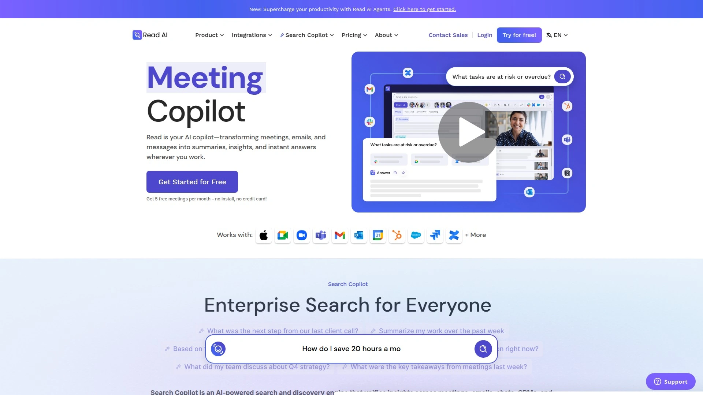

Read.ai定位为**行业领先的AI会议助手和副驾驶**,不仅转录会议,还能理解上下文、分析情绪、推荐下一步行动,无缝集成到现有工作流程。支持Zoom、Google Meet、Microsoft Teams和数十个其他原生集成,既能处理虚拟会议也能应对面对面对话。

与Otter或Gong不同,Read.ai将会议转录、AI副驾驶和企业搜索整合在一个平台中。适合任何团队或行业,可以即时扩展,通过减少会议出席、自动化跟进和在几秒钟内找到答案来实现快速投资回报。

主动推荐下一步行动,从会议数据中回答问题,与CRM和工作流软件等企业工具集成。无需设置或学习曲线,安装即用。免费套餐可用,企业许可证从每用户每月25美元起。

**安全性达到企业级标准**:SOC 2 Type 2、GDPR和HIPAA合规。对于医疗、金融等受监管行业,这些认证至关重要。视频库和参与度洞察功能提供可搜索的历史记录和情绪分析。

2025年被广泛认为是最佳AI笔记工具,超越了简单的转录功能,真正成为团队的智能助手。适合大型企业、需要严格合规性要求的组织、希望深度集成AI到工作流程的团队。

## **[Jamie.ai](https://www.meetjamie.ai)**

隐私优先的AI笔记工具,无需机器人加入会议,直接捕获电脑音频,支持MacOS和Windows。

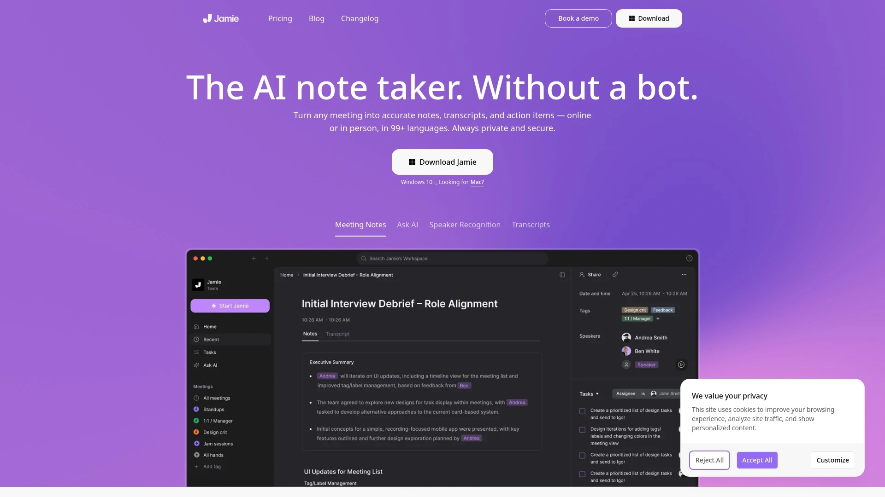

Jamie最大的特色是**不需要机器人加入会议**。它直接转录你电脑的音频,这意味着没有"Fred已加入会议"的尴尬提示,也没有额外的参与者占用屏幕空间。对于私密会议或客户不希望被录音的场合,这种方式更加低调和尊重隐私。

支持**在线和离线模式**工作,即使没有网络连接也能完成转录。这在网络不稳定或出差途中特别有用。可靠地识别说话人,提供结构化摘要包含决策和行动项。遵守GDPR法规,会议后自动删除音频文件,只保留转录文本。

一键式应用适配任何平台和现有工作流程。Ask AI聊天助手让你能搜索过去的笔记,用简单的问题找到需要的信息。多语言转录、翻译和丰富的导出选项让跨国团队协作更顺畅。

定价透明,提供免费试用。付费套餐根据使用量阶梯定价。Reddit讨论中被多次推荐为Otter.ai的隐私友好替代品。适合重视隐私、经常在不稳定网络环境工作、不希望机器人出现在参与者列表的个人用户和企业。

## **[Notta](https://www.notta.ai)**

多语言专家,支持58种语言转录,实时语音转文字准确率高,云存储整合强大。

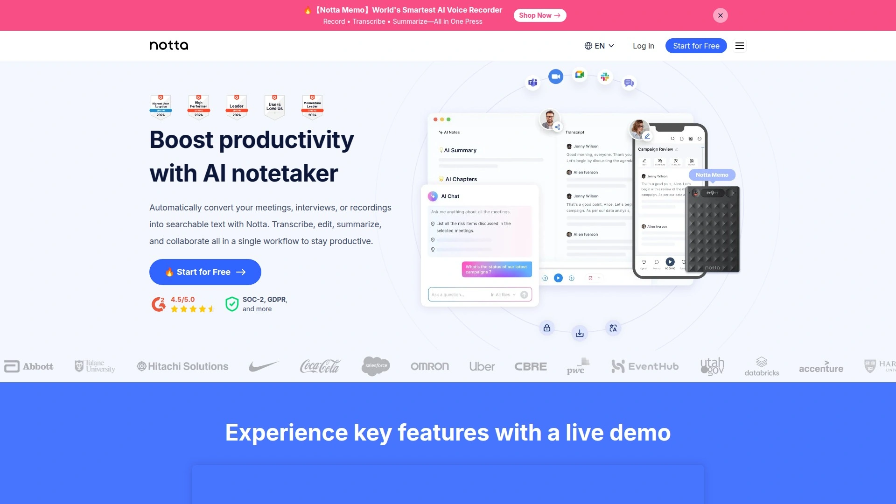

Notta专注于**准确的音频/视频文件和实时会议转录**。支持58种语言,是多语言团队的理想选择。可以直接从云存储上传音频文件进行转录,支持Dropbox、Google Drive等主流服务。

实时转录功能响应迅速,几乎零延迟地将语音转换为文字。支持Android、iOS、macOS和Windows全平台,以及Chrome浏览器扩展。免费套餐每月提供一定转录时长,付费套餐从每月10美元起,按小时计费。

自动说话人识别功能准确标注不同发言者,时间戳帮助快速定位会议中的特定时刻。转录完成后可以导出为多种格式,包括TXT、DOCX、PDF和SRT字幕文件。与Zoom、Google Meet、Microsoft Teams集成,也支持录制电话会议。

团队协作功能允许多人共同编辑和分享转录内容。AI摘要生成器自动提取会议要点,节省阅读完整转录的时间。搜索功能让你能在所有历史转录中快速找到关键词。适合跨国企业、多语言团队、需要处理大量音频文件的媒体和研究机构。

## **[Fathom](https://fathom.video)**

轻量级视频会议记录工具,专注于简洁和速度,免费套餐功能完整。

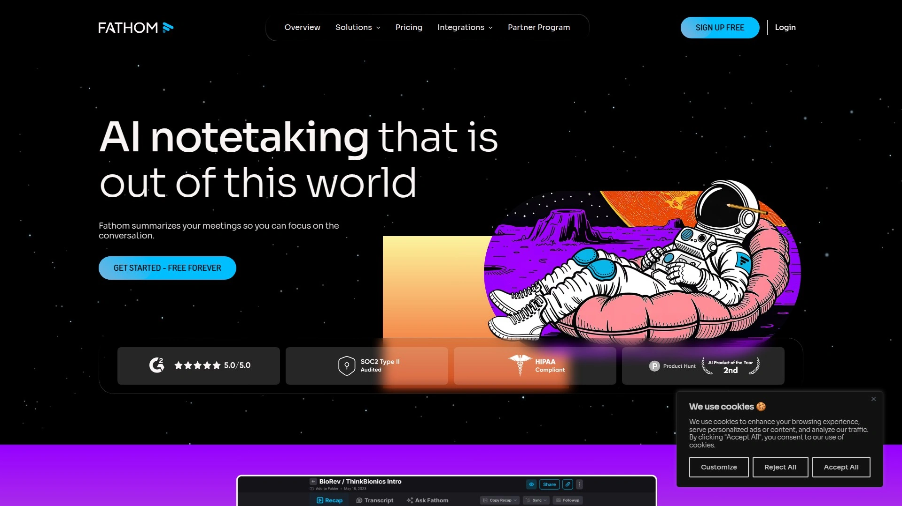

Fathom被归类为**轻量级工具,专注于转录和会议记录**。不像全功能平台那样复杂,Fathom把核心功能做到极致——快速、准确、易用。自动记录Zoom、Google Meet和Microsoft Teams会议,生成简洁的摘要和行动项。

安装和使用过程极其简单,不需要复杂的设置或培训。会议结束后立即收到转录和摘要,无需等待处理时间。免费套餐提供核心功能,对小团队和个人用户非常友好。

视频片段功能让你能标记和分享会议中的重要时刻,而不是发送整个小时的录音。与CRM系统集成,自动同步会议记录到客户档案。搜索历史会议功能帮助快速找到之前讨论过的主题。

用户评价集中在"快速""简单""不花哨但好用"这几个方面。如果你不需要复杂的分析和自动化功能,只是想要一个可靠的会议记录工具,Fathom是理想选择。适合小型团队、初创公司、个人顾问和任何重视简洁高效的用户。

## **[Sembly AI](https://www.sembly.ai)**

识别自定义短语和行话的智能助手,适合专业术语密集的行业,支持多平台集成。

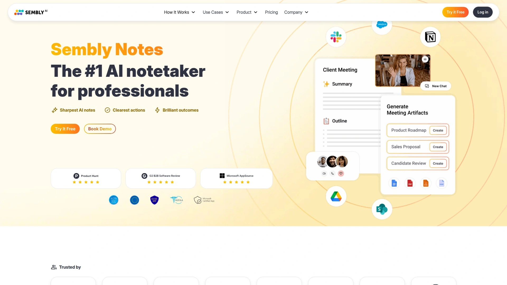

Sembly最大的亮点是**识别自定义短语和行业术语**。医疗、法律、科技等领域有大量专业术语,通用AI工具经常转录错误,但Sembly允许你训练系统识别特定词汇。这让转录准确度在专业场景下显著提升。

支持Google Meet、Zoom和Microsoft Teams,通过Chrome浏览器扩展或Web应用使用。免费套餐提供基础功能,付费套餐解锁高级识别能力和更长转录时间。自动生成会议摘要、行动项和决策点。

Sembly Insights功能分析会议模式,识别团队沟通中的趋势和问题。合规性功能确保敏感行业的会议记录符合监管要求。可搜索的会议历史让你能快速找到提到特定术语或主题的过往讨论。

与项目管理工具和CRM系统集成,自动创建任务和更新客户记录。多语言支持覆盖主流商业语言。适合医疗保健、法律服务、金融科技、软件开发等术语密集型行业,以及需要合规性记录的受监管企业。

## **[Avoma](https://www.avoma.com)**

管理整个会议生命周期的综合平台,从日程安排到跟进一站式解决,销售和客户成功团队首选。

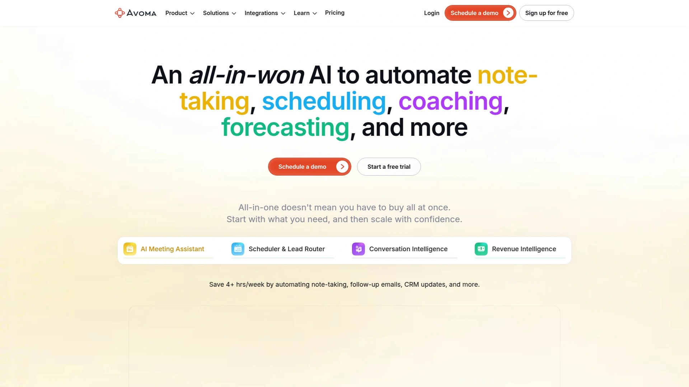

Avoma不只是会议记录工具,而是**完整的会议生命周期管理平台**。从会议前的日程安排、会议中的记录和协作、到会议后的跟进和分析,Avoma覆盖全流程。这种端到端的方法特别适合需要系统化管理客户互动的团队。

会议前功能包括日程模板、自动提醒和议程生成。会议中自动转录、实时协作笔记和智能建议。会议后生成AI摘要、提取行动项、自动发送跟进邮件。这些功能串联起来形成完整的工作流程。

对话智能分析帮助销售和客户成功团队理解客户需求、识别风险信号、发现机会。CRM集成确保所有客户互动信息自动同步到Salesforce、HubSpot等系统。团队培训功能让经理能审查通话、给予反馈、分享最佳实践。

免费套餐提供基础功能,付费套餐从每月19美元起。Android、iOS和Web平台全覆盖。收入团队报告称Avoma显著减少了会议后的行政工作量,让他们能专注在真正重要的客户关系建立上。适合销售团队、客户成功部门、需要系统化管理客户互动的B2B企业。

## **[tl;dv](https://tl.dv)**

专门优化Google Meet转录的AI工具,提供时间戳高亮和视频片段分享,免费套餐慷慨。

tl;dv最初为Google Meet量身打造,后来也支持Zoom和Microsoft Teams。**在Google Meet上的表现特别出色**,转录准确度和功能整合度都优于通用工具。如果你的团队主要使用Google Workspace,tl;dv是专门优化的选择。

时间戳功能让你能标记会议中的重要时刻,快速跳转到关键讨论。创建和分享视频片段功能特别适合培训、产品演示和客户反馈场景——你可以剪辑出精华部分分享给团队,而不是让大家看完整个会议录像。

免费套餐提供无限录制和转录,这在同类工具中非常罕见。付费套餐增加高级搜索、更长存储时间和团队协作功能。Chrome扩展安装简单,macOS和Windows桌面应用也可下载。

多语言字幕生成功能支持超过30种语言,方便国际团队或客户观看会议录像。与Slack、Notion、Google Docs等工具集成。AI摘要自动提取关键点和行动项。Reddit用户推荐tl;dv作为性价比极高的选择,特别是免费套餐的功能完整度令人印象深刻。适合Google Workspace重度用户、需要视频片段功能的培训团队、预算有限的小型企业。

## **[Grain](https://grain.com)**

为客户导向角色设计的会议记录平台,自动捕获客户洞察,构建可搜索的客户智能库。

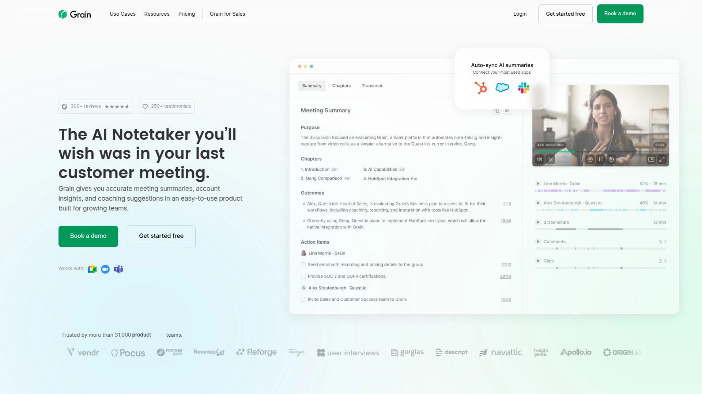

Grain专注于**客户导向的角色**,特别是客户成功、产品管理和用户研究。它不只是记录会议,而是帮你从客户对话中提取有价值的洞察,构建团队共享的客户智能库。

自动高亮功能识别客户反馈、功能请求、痛点和使用场景。这些洞察自动分类和标签,形成可搜索的知识库。产品经理可以快速找到所有提到某个功能的客户对话,设计师能回顾用户体验问题,销售团队能了解常见异议。

视频片段库让你能创建客户证言、产品反馈和用例展示的精选集。分享给团队时附带上下文和时间戳,让同事快速理解客户需求而无需观看完整会议。与Slack集成,自动分享重要客户洞察到相关频道。

免费套餐提供基础录制和转录功能,付费套餐解锁高级分析和无限存储。Web平台使用,无需下载软件。用户评价称Grain把客户反馈从分散的会议记录转变为结构化的产品洞察,显著改善了产品决策流程。适合产品团队、客户成功部门、用户研究人员、需要系统化管理客户反馈的任何角色。

## **[Krisp](https://krisp.ai)**

提供免费无限AI会议转录,同时集成降噪功能,双向音频处理让通话更清晰。

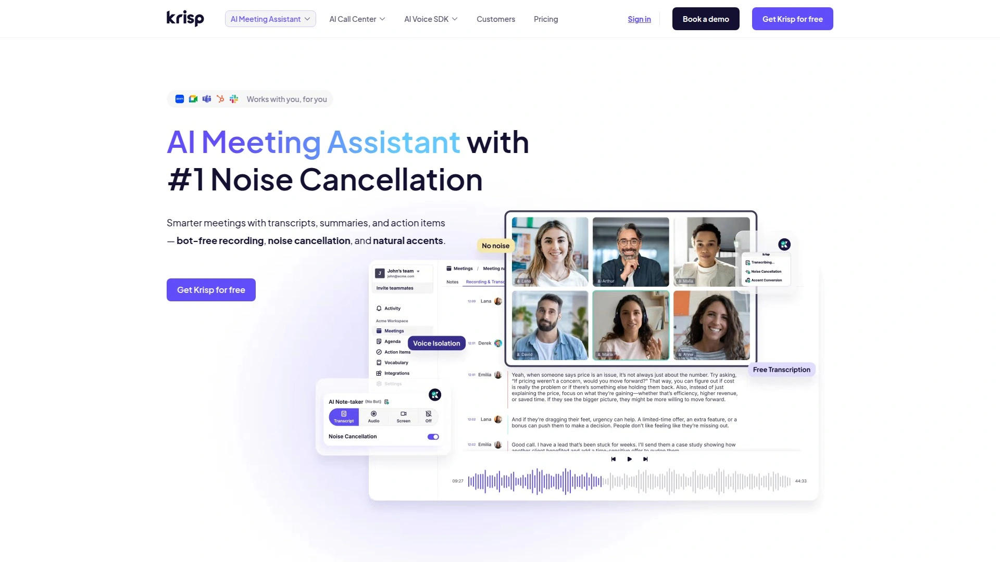

Krisp最初以**AI降噪技术**闻名,现在将会议转录整合到同一个平台。这种组合特别有价值——降噪确保你听到和被听到的声音清晰,转录确保会议内容被准确记录。两个功能互相增强,清晰的音频带来更准确的转录。

免费提供无限AI会议转录,没有时长限制,这在行业内非常罕见。降噪功能处理背景噪音、键盘敲击声、狗叫声等干扰,让你在嘈杂环境下也能专业通话。双向处理意味着既消除你这边的噪音,也过滤对方的干扰。

支持所有主流视频会议平台和VoIP应用。作为系统级应用运行,无需在每个会议软件中单独设置。macOS和Windows桌面应用安装简单,后台运行不占用系统资源。

会议摘要自动生成,包含关键讨论点和行动项。转录准确度高,特别是在使用Krisp降噪后的音频。适合经常在家办公或公共空间工作、背景噪音难以控制、同时需要会议记录功能的远程团队和数字游民。

## 常见问题

**AI会议记录工具会影响视频会议性能吗?**

取决于工具类型。机器人类工具(如Fireflies、MeetGeek)作为独立参与者加入会议,对你的电脑性能几乎没有影响,但会占用一个会议席位并出现在参与者列表。浏览器扩展(如Tactiq)在本地运行,占用少量内存但不需要机器人。桌面应用(如Jamie)直接捕获系统音频,资源占用最小但需要保持应用运行。云端处理类工具(如Read.ai)把转录任务放在服务器完成,对本地性能影响可以忽略。总体来说,现代AI记录工具优化得很好,不会明显拖慢会议体验。

**转录准确率95%意味着什么?**

每100个词中可能有5个错误。这个准确率在理想音频条件下(清晰麦克风、无背景噪音、标准口音)是可以达到的。实际使用中,准确率受多个因素影响:音频质量、说话人口音、专业术语、多人同时发言等。Fireflies和MeetGeek等领先工具声称95%准确率,但用户反馈显示复杂场景下可能需要人工校对。Sembly AI通过学习自定义术语可以提升专业场景的准确度。使用Krisp等降噪工具预处理音频能显著改善转录质量。对于关键会议,建议始终保留原始录音以便核对。

**免费套餐够用吗还是必须付费?**

看你的使用频率和需求深度。MinutesLink、Tactiq和tl;dv的免费套餐非常慷慨,基础功能完全可用。Fireflies和MeetGeek免费套餐有时长或功能限制,中度使用会触顶。如果你每周只有2-3个会议需要记录,免费套餐通常够用。但如果需要团队协作、CRM集成、无限存储、高级搜索等功能,付费套餐更合适。企业用户因为合规性和数据安全要求,通常会选择付费的企业套餐如Read.ai或Avoma。建议从免费套餐开始,确认价值后再升级。

## 结语

从实时转录到智能摘要再到行动项提取,选对AI会议记录工具能让团队协作效率提升数倍。如果你需要多语言支持、无限免费会议记录和探索AI数字化身应用,[MinutesLink](https://minuteslink.com)的零成本入门、50种语言覆盖和独特的个性化AI助手培训功能特别适合国际化团队和希望将会议积累转化为长期价值的专业人士。选择时记得先明确核心需求——是否需要机器人加入会议、主要使用哪个视频平台、团队规模多大、有无特殊合规要求——然后利用免费套餐或试用期实际测试转录准确度和摘要质量,找到最契合工作流程的那一款。
